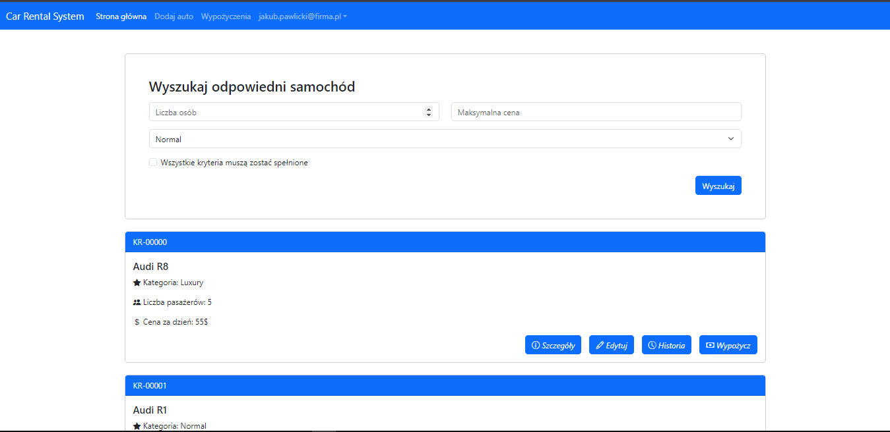

## 1. Opis projektu

Aplikacja internetowa do obsługi wypożyczalni samochodów jest przeznaczona dla pracowników firmy, umożliwiając im efektywne zarządzanie flotą pojazdów. Pracownicy mogą przeglądać listę dostępnych samochodów, wraz z ich szczegółowymi informacjami, takimi jak cena, standard, opis pojazdu, numer rejestracyjny oraz historia wypożyczeń. Aplikacja oferuje filtrowanie, które pozwala pracownikom szybko znaleźć pojazdy spełniające określone kryteria, takie jak standard pojazdu, maksymalna cena wynajmu czy liczba pasażerów. Dodatkowo, aplikacja umożliwia pracownikom dodawanie nowych samochodów do bazy danych oraz edytowanie informacji o istniejących pojazdach. Dzięki temu, flota pojazdów jest zawsze aktualna i zawiera wszystkie niezbędne informacje. Aplikacja zawiera również funkcję przeglądania listy aktualnie wypożyczonych samochodów, co pozwala na monitorowanie stanu floty w czasie rzeczywistym. Pracownicy mogą ustawić auto jako wypożyczone, wpisując dane klienta oraz okres wypożyczenia, co pozwala na dokładne śledzenie wynajmów. Pracownicy mają także możliwość zmiany swojego hasła, co zwiększa bezpieczeństwo i personalizację dostępu do systemu.

----------

## 2. Analiza wymagań

### 2.1 Wymagania funkcjonalne

- **Rejestracja użytkowników:** System musi umożliwiać użytkownikom rejestrację poprzez podanie imienia, nazwiska, adresu e-mail znajdującego się w domenie firmy i hasła.
- **Logowanie użytkowników:** System musi umożliwiać zalogowanie się zarejestrowanym użytkownikom przy użyciu adresu e-mail i hasła.
- **Przeglądanie listy pojazdów:** System musi umożliwiać przeglądanie listy wszystkich dostępnych samochodów w bazie danych.
- **Wyświetlanie szczegółów pojazdu:** System musi umożliwiać wyświetlanie szczegółowych informacji o wybranym samochodzie, w tym cenę, standard, opis, numer rejestracyjny oraz historię wypożyczeń.
- **Filtrowanie pojazdów:** System musi umożliwiać filtrowanie listy pojazdów według kryteriów takich jak standard, maksymalna cena i liczba pasażerów.
- **Dodawanie nowego pojazdu:** System musi umożliwiać pracownikom dodawanie nowych samochodów do bazy danych, wprowadzając wszystkie niezbędne informacje.
- **Edytowanie istniejącego pojazdu:** System musi umożliwiać edytowanie informacji o istniejących pojazdach w bazie danych.
- **Oznaczanie pojazdu jako wypożyczony:** System musi umożliwiać pracownikom oznaczenie samochodu jako wypożyczonego, wpisując dane klienta oraz okres wypożyczenia.
- **Lista aktualnie wypożyczonych pojazdów:** System musi umożliwiać wyświetlanie listy wszystkich aktualnie wypożyczonych samochodów wraz z informacjami o klientach i okresach wynajmu.
- **Potwierdzenie oddania pojazdu:** System musi umożliwiać pracownikom potwierdzenie oddania pojazdu przez klienta na liście aktualnie wypożyczonych samochodów.
- **Anulowanie wypożyczenia:** System musi umożliwiać pracownikom anulowanie wypożyczenia pojazdu na liście aktualnie wypożyczonych samochodów.
- **Zmiana hasła użytkownika:** System musi umożliwiać pracownikom zmianę hasła do swojego konta, zwiększając bezpieczeństwo systemu.

### 2.2 Wymagania niefunkcjonalne

-   **Wydajność**: Aplikacja powinna pracować wydajnie tak, aby sprawnie zwracać samochody znajdujące się w bazie danych oraz historię wypożyczeń aut.
-   **Responsywność**: Interfejs użytkownika musi być responsywny i działać płynnie na różnych urządzeniach, takich jak komputery stacjonarne oraz tablety.
-   **Bezpieczeństwo**: Dane klientów i informacje o wypożyczeniach muszą być przechowywane w sposób bezpieczny, zgodnie z obowiązującymi przepisami o ochronie danych osobowych.
-   **Dostępność**: Aplikacja powinna być dostępna dla pracowników przez 99.9% czasu, z wyjątkiem planowanych przerw na konserwację.
-   **Szyfrowanie danych**: Wszystkie dane przesyłane między użytkownikiem a serwerem muszą być szyfrowane za pomocą protokołu HTTPS.
-   **Łatwość użycia**: Interfejs użytkownika powinien być intuicyjny i łatwy w nawigacji, umożliwiając pracownikom szybkie wykonanie zadań.
-   **Skalowalność**: Aplikacja powinna być zaprojektowana tak, aby mogła być łatwo rozszerzana o nowe funkcje i obsługiwać większą liczbę pracowników oraz rosnącą flotę aut w przyszłości.
-   **Kompatybilność przeglądarek**: Aplikacja musi być kompatybilna z najnowszymi wersjami popularnych przeglądarek, takich jak Chrome, Firefox, Safari i Edge.
-   **Czas ładowania**: Strony aplikacji powinny ładować się w czasie nie dłuższym niż 3 sekundy przy standardowym połączeniu internetowym.
-   **Wsparcie techniczne**: Powinna istnieć dostępna pomoc techniczna dla pracowników, oferująca wsparcie w godzinach pracy firmy.

----------
## 3. Wireframes
### 3.1 Strona rejestracji


### 3.2 Strona logowania


### 3.3 Strona główna


### 3.4 Strona detali auta


### 3.5 Strona edycji auta


### 3.6 Strona historii wypożyczeń auta


### 3.7 Strona wypożyczania auta


### 3.8 Strona z listą aktualnych wypożyczeń


### 3.9 Strona z formularzem dodawania auta


### 3.10 Strona edycji konta


## 4. Diagramy

W obecnej wersji aplikacji nie występują połączenia między modułami inne niż standardowe. Poniższy schemat przedstawia metody dostępne w kontrolerach i podstawowy zarys tabel w relacyjnej bazie danych.


## 5. Zastosowane technologie, struktura projektu

### 5.1 Zastosowane technologie

-   **Node.js**: Środowisko uruchomieniowe JS na serwerze.
-   **Express**: Framework dla Node.js do tworzenia aplikacji webowych.
-   **Handlebars**: Silnik szablonów do stworzenia graficznego interfejsu użytkownika.
-   **MySQL**: Relacyjna baza danych.

### 5.2 Uzasadnienie wyboru wykorzystanych technologii

-   **Node.js**: Zastosowany ze względu na wydajność oraz możliwość obsługi dużej liczby równoczesnych połączeń dzięki asynchronicznej naturze JavaScript.
-   **Express**: Wybrany ze względu na uproszczenie tworzenia aplikacji webowych poprzez dostarczenie lekkiego i elastycznego zestawu narzędzi do obsługi tras, middleware i żądań HTTP.
-   **Handlebars**: Wykorzystany do dynamicznego generowania HTML, co ułatwia oddzielenie logiki od warstwy prezentacji.
-   **MySQL**: Zastosowany z uwagi na niezawodność, wydajność i szeroką akceptację, zapewniającą skalowalność i integralność danych w projekcie.

### 5.3 Zastosowane biblioteki:

- **express-handlebars**: Jest to silnik szablonów dla express.js. Został zastosowany, aby rednerować dynamiczny HTML przy użyciu zdefiniowanych szablonów.
- **body-parser**: Jest to middleware, który parsuje treść żądań HTTP. Został zastosowany, aby mieć łatwy dostęp do danych w formacie JSON w obiektach req.body. 
- **express-session**: Jest to middleware który zarządza sesjami użytkowników. Przechowuje dane sesji po stronie serwera. Został zastosowany, aby śledzić stan sesji między różnymi zapytaniami od tego samego klienta.
- **dotenv**: Pozwala na ładowanie zmiennych środowiskowych z pliku .env do procesu Node.js. Wykorzystany, aby nie przechowywać ważnych danych takich jak sekretne klucze bezpośrednio w kodzie.
- **passport**: Został zastosowany, aby ułatwić logowanie oraz autoryzację użytkowników.
- **bcrypt**: Jest to biblioteka do haszowania haseł. Została zastosowana aby przechowywać hasła użytkowników w bazie danych w bezpieczny sposób.
- **mysql2**: Umożliwa łączenie się z bazą danych MySQL, wykonywanie zapytań SQL. Została wykorzystana, aby ułatwić zarządzenie danymi w bazie danych.

### 5.3 Kroki wymagane do instalacji i uruchomienia aplikacji
1. Stwórz plik .env ze zmiennymi:
```plaintext
DATABASE_HOST =
DATABASE_USER =
DATABASE_PASSWORD =
DATABASE_NAME =
SECRET_KEY =
```

2.  Stwórz bazę danych o nazwie <DATABASE_NAME>, wszystkie potrzebne tabele zostaną automatycznie stworzone.
            
```sql
mysql -u root -p
DROP DATABASE <DATABASE_NAME>;
CREATE DATABASE <DATABASE_NAME>;
```
    
3.  Przed uruchomieniem aplikacji, zainstaluj niezbędne biblioteki:
        
    `npm install` 
    
4.  Aby uruchomić jednocześnie frontend i backend, wpisz:
            
    `npm start` 
    
5.  Aplikacja zostanie uruchomiona pod adresem: [localhost:3000](http://localhost:3000).
    
6.  Aby zalogować się do aplikacji można użyć domyślnego konta:
    
    -   Login: admin@firma.pl
    -   Hasło: admin

### 5.4 Struktura repozytorium

```
project
│   .env
│   app.js
│   database.js
│   package.json
│   passport-config.js
│   passport-config.json
│
├───controllers
│       accountController.js
│       authController.js
│       carManagementController.js
│
├───public
│   ├───css
│   │       loginPage.css
│   │       main.css
│   │
│   └───js
│           editCar.js
│           rentCar.js
│
├───routers
│   ├───carManagement
│   │       carManagement.js
│   │
│   ├───userAuthorization
│   │       userAuthorization.js
│   │
│   └───userManagement
│           userManagement.js
│
└───views
    ├───carManagement
    │       addCar.hbs
    │       carHistory.hbs
    │       carInfo.hbs
    │       editCar.hbs
    │       rentCar.hbs
    │       rentList.hbs
    │
    ├───layouts
    │       main.hbs
    │
    ├───partials
    │       carForm.hbs
    │
    ├───userAuthorization
    │       loginPage.hbs
    │       registerPage.hbs
    │
    └───userManagement
            deleteAccount.hbs
            userSettings.hbs
            homePage.hbs
```
----------

## 6. Przypadki użycia dla pracownika

### 6.1 Przeglądanie listy pojazdów

-   **Opis**: Pracownik przegląda listę wszystkich dostępnych samochodów w bazie danych.
-   **Aktorzy**: Pracownik
-   **Warunki wstępne**: Pracownik nie jest zalogowany do aplikacji.
-   **Kroki**:
    1.  Pracownik loguje się do aplikacji.
    2.  Pracownik wybiera opcję przeglądania listy pojazdów.
    3.  Aplikacja wyświetla listę dostępnych samochodów.
-   **Warunki końcowe**: Lista dostępnych pojazdów jest wyświetlona pracownikowi.

### 6.2 Wyświetlanie szczegółów pojazdu

-   **Opis**: Pracownik wyświetla szczegółowe informacje o wybranym samochodzie.
-   **Aktorzy**: Pracownik
-   **Warunki wstępne**: Pracownik jest zalogowany do aplikacji.
-   **Kroki**:
    1.  Pracownik przegląda listę pojazdów.
    2.  Pracownik wybiera konkretny samochód.
    3.  Aplikacja wyświetla szczegółowe informacje o wybranym pojeździe.
-   **Warunki końcowe**: Szczegółowe informacje o wybranym pojeździe są wyświetlone pracownikowi.

### 6.3 Filtrowanie pojazdów

-   **Opis**: Pracownik filtruje listę pojazdów według określonych kryteriów.
-   **Aktorzy**: Pracownik
-   **Warunki wstępne**: Pracownik jest zalogowany do aplikacji.
-   **Kroki**:
    1.  Pracownik wybiera opcję filtrowania pojazdów.
    2.  Pracownik ustawia kryteria filtrowania (np. standard, maksymalna cena, liczba pasażerów).
    3.  Aplikacja wyświetla listę pojazdów spełniających wybrane kryteria.
-   **Warunki końcowe**: Lista pojazdów spełniających wybrane kryteria jest wyświetlona pracownikowi.

### 6.4 Dodawanie nowego pojazdu

-   **Opis**: Pracownik dodaje nowy samochód do bazy danych.
-   **Aktorzy**: Pracownik
-   **Warunki wstępne**: Pracownik jest zalogowany do aplikacji.
-   **Kroki**:
    1.  Pracownik wybiera opcję dodania nowego pojazdu.
    2.  Pracownik wprowadza wszystkie wymagane informacje o samochodzie.
    3.  Aplikacja zapisuje nowy pojazd w bazie danych i potwierdza dodanie.
-   **Warunki końcowe**: Nowy pojazd jest dodany do bazy danych i potwierdzony przez aplikację.

### 6.5 Edytowanie istniejącego pojazdu

-   **Opis**: Pracownik edytuje informacje o istniejącym samochodzie.
-   **Aktorzy**: Pracownik
-   **Warunki wstępne**: Pracownik jest zalogowany do aplikacji i przegląda listę pojazdów.
-   **Kroki**:
    1.  Pracownik wybiera pojazd z listy dostępnych samochodów.
    2.  Pracownik wybiera opcję edytowania pojazdu.
    3.  Pracownik aktualizuje informacje o samochodzie.
    4.  Aplikacja zapisuje zmiany w bazie danych i potwierdza edycję.
-   **Warunki końcowe**: Zmiany w informacjach o pojeździe są zapisane i potwierdzone przez aplikację.

### 6.6 Oznaczanie pojazdu jako wypożyczony

-   **Opis**: Pracownik oznacza samochód jako wypożyczony, wprowadzając dane klienta i okres wypożyczenia.
-   **Aktorzy**: Pracownik
-   **Warunki wstępne**: Pracownik jest zalogowany do aplikacji i przegląda listę pojazdów.
-   **Kroki**:
    1.  Pracownik wybiera pojazd z listy dostępnych samochodów.
    2.  Pracownik wybiera opcję oznaczenia pojazdu jako wypożyczony.
    3.  Pracownik wprowadza dane klienta i okres wypożyczenia.
    4.  Aplikacja zapisuje informacje o wypożyczeniu i oznacza pojazd jako wypożyczony.
-   **Warunki końcowe**: Pojazd jest oznaczony jako wypożyczony, a dane klienta i okres wypożyczenia są zapisane.

### 6.7 Potwierdzenie oddania pojazdu

-   **Opis**: Pracownik potwierdza, że pojazd został oddany przez klienta.
-   **Aktorzy**: Pracownik
-   **Warunki wstępne**: Pracownik jest zalogowany do aplikacji.
-   **Kroki**:
    1.  Pracownik przegląda listę aktualnie wypożyczonych pojazdów.
    2.  Pracownik wybiera pojazd, który został oddany.
    3.  Pracownik wybiera opcję potwierdzenia oddania pojazdu.
    4.  Aplikacja aktualizuje status pojazdu na dostępny i zapisuje informacje o zwrocie.
-   **Warunki końcowe**: Status pojazdu jest zaktualizowany na dostępny, a informacje o zwrocie są zapisane.

### 6.8 Anulowanie wypożyczenia

-   **Opis**: Pracownik anuluje wypożyczenie pojazdu przed jego rozpoczęciem.
-   **Aktorzy**: Pracownik
-   **Warunki wstępne**: Pracownik jest zalogowany do aplikacji.
-   **Kroki**:
    1.  Pracownik przegląda listę aktualnie wypożyczonych pojazdów.
    2.  Pracownik wybiera pojazd, którego wypożyczenie ma być anulowane.
    3.  Pracownik wybiera opcję anulowania wypożyczenia.
    4.  Aplikacja aktualizuje status pojazdu na dostępny i usuwa informacje o wypożyczeniu.
-   **Warunki końcowe**: Wypożyczenie jest anulowane, a status pojazdu zaktualizowany na dostępny.

----------

## 7. Planowany rozwój aplikacji

-   Wprowadzenie możliwości dodania zdjęć aut znajdujących się w bazie danych.
-   Stworzenie panelu administratora, który będzie miał możliwość zarządzania pracownikami.
-   Rozbudowanie formularza zwrotu aut – dodanie pola na informacje dodatkowe, spowodowane szkody.
-   Stworzenie części dla klienta, w której będzie mógł przejrzeć listę dostępnych aut i utworzyć rezerwacje na dany samochód.
  
   ## 8. Planowany rozwój testów
   Rozbudowanie repozytorium kodu o testy:
   * jednostkowe - sprawdzenie poprawności działania funkcji każdej z osobna.
   * integracyjne - sprwawdzenie poprawności współpracy połączonych komponentów.
   * automatyczne testy GUI - sprawdzenie poprawności działania aplikacji za pomocą automatycznych testów interfejsu użytkownika.
